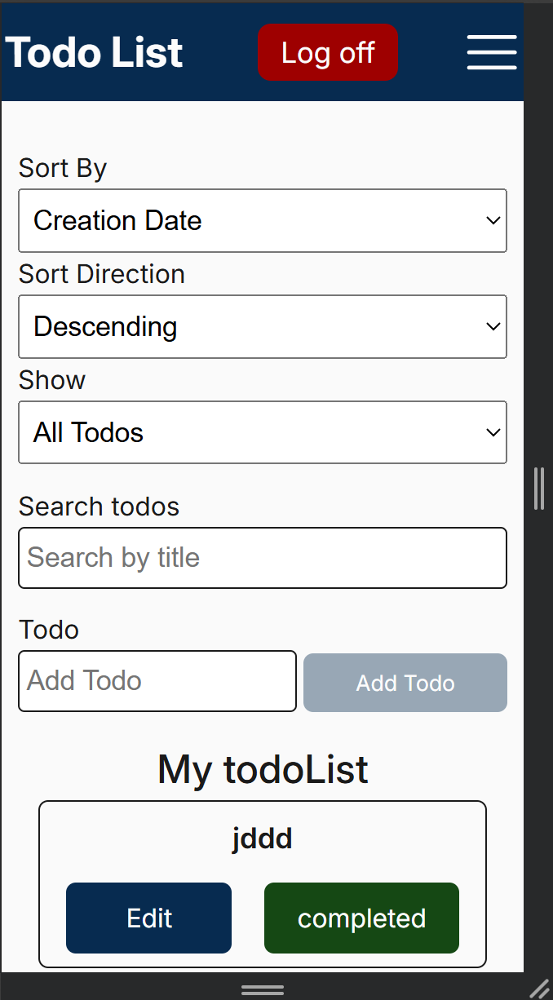
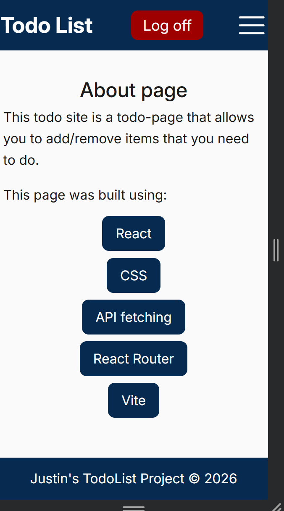
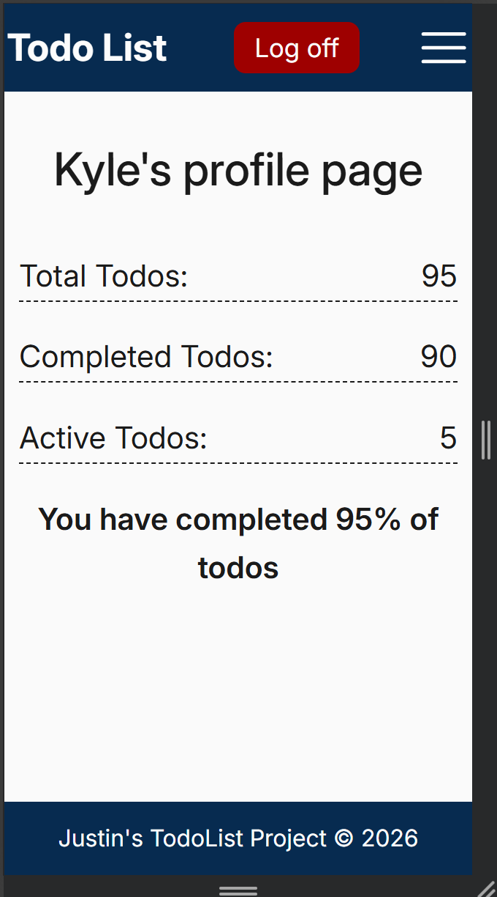
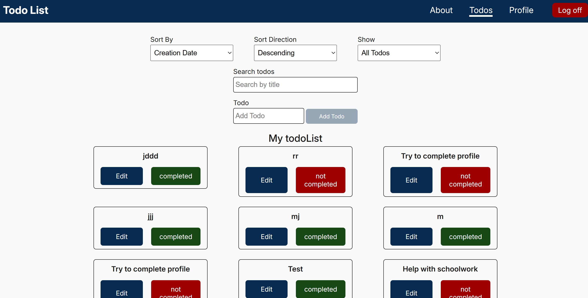
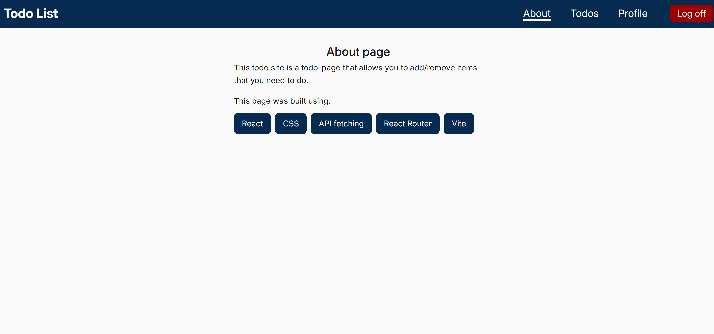
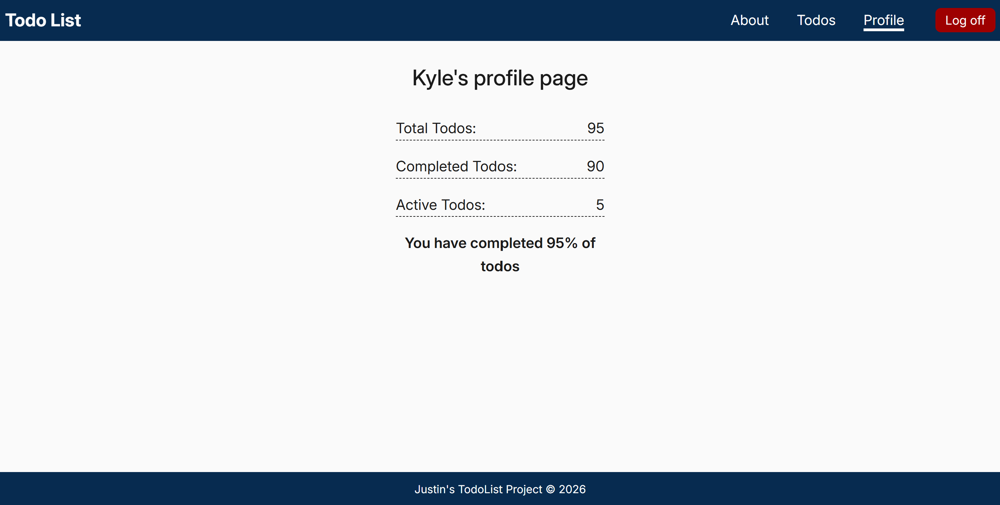

# TodoList App

An app that allows users to add items to a list, so users can keep track of what they need to do.

---

## Features List
- Clean user interface that allows user to easily organize their activiies
- Responsive and adapts to all screen sizes
- uses React Router to allow users to instantly navigate pages without a refresh
- contains filtering/searching logic to allow users to find their todos instantly

---

## Technologies Used
- React
- Module CSS
- React Router

--- 

## Screenshots

### Mobile 




### Desktop




---

## Running the Project

1) Clone the repository

```bash 
git clone git@github.com:justinjones38/todo-list.git
```

2) Install the dependencies

```bash
npm install
```


3) Run the development server
```bash 
npm run dev
```

4)  Open the local host (ex: http:/localhost:5173/) and view in your browser

---

## Available Scripts
npm run dev: allows you to run the web app in your local server

npm run build: compiles, bundles, and optimizes your application's code and gets it ready for production

npm run preview: launches a local static web server to test your application's production build first.


## Design Decisions
My primary design was to make a clean app that is accessible for all users. I decided on a dark blue base because I wanted a color scheme that was laid back but appealing to users. I used contrast checkers to get a base on the colors to ensure that they are easy to read for users. The main purpose of my design was an easy-to-read and clean user interface for all users.

---

## Future Improvements
- [ ] Prevent user from needing to re-log in after every refresh.
- [ ] The option to remove completed todo from appearing on the list.
- [ ] The option to uncomplete todos.

---

## License Information
[My GitHub Profile](https://github.com/justinjones38)

---
